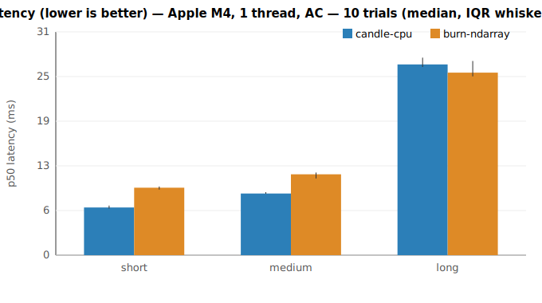
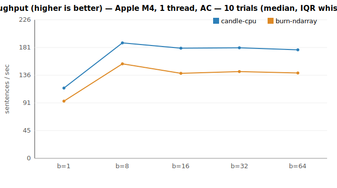
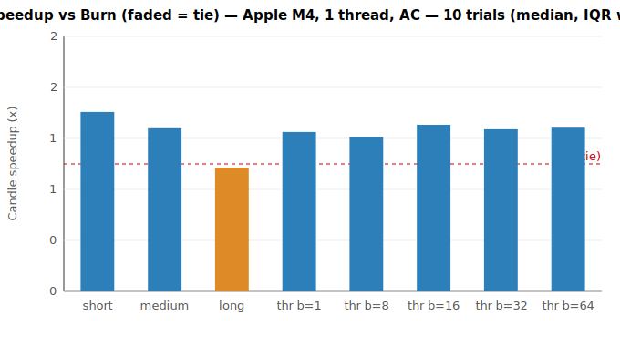

# Candle vs Burn — benchmark report (Phase 1)

**Recommendation: use Candle for the NAHPU desktop embedding workload.**
Candle is faster for interactive search (single-query latency on short/medium
text) and for bulk indexing (throughput at every batch size). Burn is marginally
faster only on long inputs. Revisit if scope changes (see caveats).

## Environment

- CPU: **Apple M4** (4 performance + 6 efficiency cores), 1 thread (`RAYON_NUM_THREADS=1`), **AC power**
- macOS arm64, all-MiniLM-L6-v2 (384-dim), f32, inference only
- Candle 0.9 (safetensors) vs Burn 0.21 (ndarray backend, ONNX import)
- 10 interleaved trials; tables show **median [IQR]** across trials
- Parity gate (Phase 0): min cosine similarity **1.000000** — engines are equivalent

## Results

| Scenario | Candle | Burn | Candle speedup | Verdict |
|---|---|---|---|---|
| Latency, short (~3 tok) | **6.71 ms** [0.41] | 9.49 ms [0.42] | 1.41× | Candle |
| Latency, medium (~10 tok) | **8.67 ms** [0.23] | 11.37 ms [0.83] | 1.28× | Candle |
| Latency, long (~50 tok) | 26.82 ms [1.30] | **25.67 ms** [2.17] | 0.97× | Burn |
| Throughput, batch 1 | **115/s** [8] | 93/s [5] | 1.25× | Candle |
| Throughput, batch 8 | **189/s** [12] | 154/s [5] | 1.21× | Candle |
| Throughput, batch 16 | **180/s** [8] | 139/s [6] | 1.31× | Candle |
| Throughput, batch 32 | **181/s** [2] | 142/s [2] | 1.27× | Candle |
| Throughput, batch 64 | **177/s** [5] | 139/s [2] | 1.28× | Candle |

## How to read this (methodology)

An unpinned laptop drifts run-to-run by more than 5% (Apple Silicon P/E-core
scheduling + power management), so absolute single-run reproducibility is not
achievable here. We therefore **interleave** the two engines within each trial
(order alternates) so both see identical conditions, then report the **per-trial
speedup ratio**. A scenario is called **distinguishable** when the IQR of that
ratio excludes 1.0 — i.e. the effect size exceeds the run-to-run spread. All
scenarios above are distinguishable.

## Interpretation for NAHPU

- **Interactive semantic search** (the latency-critical path) uses short/medium
  queries → Candle is ~1.3–1.4× faster. This is the UX-facing win.
- **Bulk indexing** of the existing collection → Candle ~1.2–1.3× higher
  throughput across all batch sizes.
- **Long inputs**: Burn edges ahead by ~3%, but full field notes are rarely the
  query path; this does not outweigh the search/indexing wins.

## Caveats / revisit triggers

- **Desktop only.** The Flutter (FFI) layer is a framework-agnostic constant and
  does not change this ranking. Mobile is out of scope and *could* invert it
  (Candle is CPU-only on iOS; Burn reaches the GPU via wgpu).
- **CPU single-thread baseline.** Multi-thread / GPU (Metal vs wgpu) is Phase 2.
- Re-evaluate Burn if **on-device training/fine-tuning** or **iOS GPU** enter scope.

Reproduce: `scripts/fetch-model.sh && RAYON_NUM_THREADS=1 cargo run --release -p runner --bin bench && python3 scripts/plot.py`
