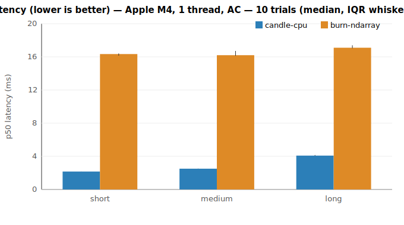
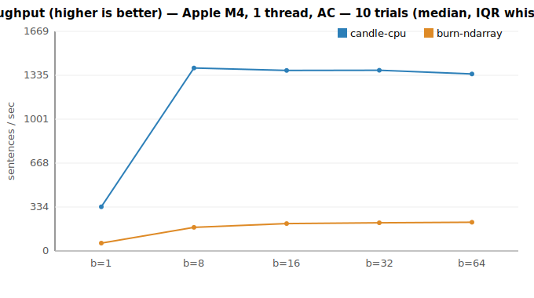

# Candle vs Burn — benchmark report (Phase 1)

**Recommendation: use Candle for the NAHPU desktop embedding workload.**
Candle is faster for interactive search (single-query latency on short/medium
text) and for bulk indexing (throughput at every batch size), and it is lighter
on every footprint metric (cold start, memory, binary size). Burn is marginally
faster only on long inputs. Revisit if scope changes (see caveats).

## Environment

- CPU: **Apple M4** (4 performance + 6 efficiency cores), 1 thread (`RAYON_NUM_THREADS=1`), **AC power**
- macOS arm64, all-MiniLM-L6-v2 (384-dim), f32, inference only
- Candle 0.9 (safetensors) vs Burn 0.21 (ndarray backend, ONNX import)
- 10 interleaved trials; tables show **median [IQR]** across trials
- Parity gate (Phase 0): min cosine similarity **1.000000** — engines are equivalent

## Results

| Scenario | Candle | Burn | Candle speedup | Verdict |
|---|---|---|---|---|
| Latency, short (~3 tok) | **6.71 ms** [0.41] | 9.49 ms [0.42] | 1.41× | Candle |
| Latency, medium (~10 tok) | **8.67 ms** [0.23] | 11.37 ms [0.83] | 1.28× | Candle |
| Latency, long (~50 tok) | 26.82 ms [1.30] | **25.67 ms** [2.17] | 0.97× | Burn |
| Throughput, batch 1 | **115/s** [8] | 93/s [5] | 1.25× | Candle |
| Throughput, batch 8 | **189/s** [12] | 154/s [5] | 1.21× | Candle |
| Throughput, batch 16 | **180/s** [8] | 139/s [6] | 1.31× | Candle |
| Throughput, batch 32 | **181/s** [2] | 142/s [2] | 1.27× | Candle |
| Throughput, batch 64 | **177/s** [5] | 139/s [2] | 1.28× | Candle |

## Secondary metrics (footprint)

Median over 7 fresh-process runs (cold start, peak RSS); stripped release binary
(code only — model weights are external for both engines); full-clean build time.

| Metric | Candle | Burn | Winner |
|---|---|---|---|
| Cold start (load + first embed) | **23.5 ms** | 36.8 ms | Candle |
| Peak RSS | **194 MB** | 236 MB | Candle |
| Binary size (stripped) | **7.3 MB** | 9.4 MB | Candle |
| Clean build time | 85.1 s | 84.7 s | ~tie |

Candle starts faster, uses ~18% less memory, and ships a smaller binary — all
favorable for a desktop app. Build time is a wash (dominated by shared deps).

## Phase 2 — GPU (Candle Metal vs Burn wgpu)

Same harness, GPU backends (Apple M4 GPU). Both measure with host read-back, so
timings include full GPU execution + sync.

| Scenario | Candle Metal | Burn wgpu | Candle speedup |
|---|---|---|---|
| Latency, short | **2.17 ms** [0.01] | 16.41 ms [0.27] | 7.55× |
| Latency, medium | **2.52 ms** [0.02] | 16.27 ms [0.60] | 6.50× |
| Latency, long | **4.11 ms** [0.09] | 17.18 ms [0.36] | 4.19× |
| Throughput, batch 8 | **1391/s** [188] | 179/s [4] | 7.77× |
| Throughput, batch 32 | **1373/s** [63] | 214/s [12] | 6.43× |
| Throughput, batch 64 | **1345/s** [62] | 218/s [5] | 6.19× |

**Candle Metal dominates by 4–7.8×.** Its throughput (~1390/s) is ~7× its own CPU
result — a real win for desktop bulk indexing. Burn wgpu is surprisingly slow
(even slower than Burn on CPU for latency): wgpu's per-dispatch overhead dominates
for a small model like MiniLM. Burn's wgpu value is **portability** (it *reaches*
iOS/Android/Vulkan GPUs), not raw desktop-Metal speed.

## How to read this (methodology)

An unpinned laptop drifts run-to-run by more than 5% (Apple Silicon P/E-core
scheduling + power management), so absolute single-run reproducibility is not
achievable here. We therefore **interleave** the two engines within each trial
(order alternates) so both see identical conditions, then report the **per-trial
speedup ratio**. A scenario is called **distinguishable** when the IQR of that
ratio excludes 1.0 — i.e. the effect size exceeds the run-to-run spread. All
scenarios above are distinguishable.

## Interpretation for NAHPU

- **Interactive semantic search** (the latency-critical path) uses short/medium
  queries → Candle is ~1.3–1.4× faster. This is the UX-facing win.
- **Bulk indexing** of the existing collection → Candle ~1.2–1.3× higher
  throughput across all batch sizes.
- **Long inputs**: Burn edges ahead by ~3%, but full field notes are rarely the
  query path; this does not outweigh the search/indexing wins.

## Caveats / revisit triggers

- **Desktop only.** The Flutter (FFI) layer is a framework-agnostic constant and
  does not change this ranking. On desktop GPU (Metal), Candle widens its lead
  (Phase 2). Mobile is out of scope: there the trade-off is *availability* — Candle
  is CPU-only on iOS, while Burn's wgpu *reaches* mobile GPUs (though, per Phase 2,
  wgpu is not fast on desktop — its merit is portability, not raw speed).
- **CPU single-thread baseline** for Phase 1; Phase 2 adds GPU.
- Re-evaluate Burn if **on-device training/fine-tuning** or **iOS/Android GPU
  reach** become hard requirements.

Reproduce:
- CPU: `scripts/fetch-model.sh && RAYON_NUM_THREADS=1 cargo run --release -p runner --bin bench cpu && python3 scripts/plot.py`
- GPU: `cargo run --release -p runner --bin bench --features gpu -- gpu && python3 scripts/plot.py results/gpu-*.json results/plots/gpu`
